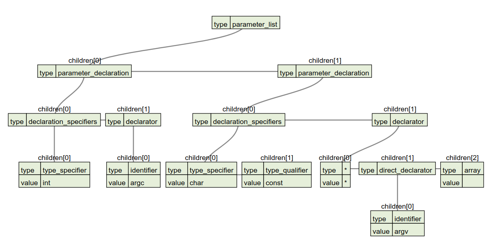

# ANSI-C语言编译器设计实验报告

> 具体这一页留空，到时候放学校的实验报告封面

<div style="page-break-after: always;"></div>

[TOC]

## 一、序言

### 实验目的

### 实现情况

#### 整个流程怎么怎么样（源代码->语法树->中间代码->目标代码）

#### 实现的语言特性：包括数据类型、语法实现那些、错误恢复

## 二、实验环境

- 开发环境：

  - Fedora
  - Ubuntu

- 开发工具：

  | 工具名称 | 最低版本 | 功能                   |
  | -------- | -------- | ---------------------- |
  | cmake    | 3.3      | 构建跨平台的开发环境   |
  | g++      | 7.4.0    | 开发使用编译器         |
  | flex     | 2.6.4    | 词法分析               |
  | bison    | 3.0.4    | 语法分析               |
  | llvm     | 6.0.0    | 中间代码生成及目标代码 |
  | git      | 2.17.1   | 代码版本管理工具       |

## 三、词法分析

### 基本的词法规则

我们的`MiniCompiler`的词法部分完全兼容ANSI C的词法部分，支持所有的ANSI C的关键字，并且支持`...`不定参数的词法形式和支持用`<%`和`%>`替代`{`和`}`以及用`<:`和`:>`替代`[`和`]`的词法。

基本的词法部分的实现比较简单，为了避免关键字和`identifier`的冲突，关键字放在`identifier`的上面，提高优先级。

### 特殊的词法规则

除了基本的词法以外，相对复杂的词法就是注释和一些常量的词法，在这里，我们的词法分析器除了ANSI C支持的块注释以外，还支持单行注释。下面介绍一下我们的实现情况。

#### 注释

词法分析器支持注释有助于我们后期的测试，我们实现了单行注释以及块注释：

- 块注释

  块注释的正则表达式如下：

  ```
  block_comment	\/\*([^*]*\*+[^/*])*([^*]*\*+)\/
  ```

  - <font color=orange>\/\\\*</font>匹配块注释开头的`/*`
  - <font color=orange>(\[^\*\]\*\\\*+\[^/\*\])\*</font>匹配若干个不是`*\`的但包含至少一个`*`的串
  - <font color=orange>(\[^\*]\*)</font>匹配不包含`*`的串
  - <font color=orange>\\\*+\/</font>匹配第一个出现的`*/`

- 行注释

  行注释的正则表达式如下：

  ```
  line_comment	\/\/.*
  ```

  行注释相对简单很多，只要匹配到第一个`//`，后面的所有字符都忽略，直到换行符为止。

  - <font color=orange>\\/\\/</font>匹配行注释开头的`//`
  - <font color=orange>.*</font>匹配非换行符的任意字符

#### 常量

- 字符

  在ANSI C里，我们允许单引号内有超过一个字符，这只是一个警告，所以我们词法分析器保持这个特性，对应的正则表达式如下：

  ```
  char			\'(\\.|[^\\'])*\'
  ```

  - <font color=orange>\\'</font>匹配开头的单引号`'`
  - <font color=orange>\\\.</font>匹配以`\`开头后加任意非换行符的字符的转义字符
  - <font color=orange>\[^\\\\'\]</font>匹配不以`\`开头的正常字符
  - <font color=orange>(\\\\.|\[^\\\\'\])*</font>表示匹配转义字符和正常字符若干个
  - <font color=orange>\\'</font>匹配最后结束的单引号`'`

- 字符串

  字符串的正则表达式如下：

  ```
  string			\"([^\\"\n]|\\.)*\"
  ```

  这部分和上面的字符正则表达式比较相似，就不作过多的解释了。

- 十六进制的整型

  十六进制的整形的正则表达式如下：

  ```
  hex_num			0[xX][a-fA-F0-9]+
  ```

  我们的整形支持十进制和十六进制的形式，而十六进制的整数的值转换为十进制整数的值的过程是在词法分析过程中实现的，我们使用以下这个函数作转换：

  ```c++
  inline std::string hex2num()
  {
  	unsigned long res = 0;
  	char c;
  	for (int i = 2; i < yyleng; ++i)
  	{
  		c = yytext[i];
  		res = res * 16 + (c <= '9' ? (c - '0')
  								   : (c & 0xdf) - 'A' + 10);
  	}
  	return std::to_string(res);
  }
  ```

- 指数型浮点数

  指数型浮点数的正则表达式如下：

  ```
  e_float			({num}|{float_num})[eE][+-]?{num}
  ```

  同样，我们的指数型浮点数也会通过以下这个函数转换成一般的浮点数的格式：
  
  ```c++
  inline std::string e2float()
  {
  	double head = 0;
  	long exp = 0;
  	for (int i = 0; i < yyleng; ++i)
  	{
  		if ((yytext[i] & 0xdf) == 'E')
  		{
  			head = std::stod(std::string(yytext).substr(0, i));
  			exp = std::stoi(std::string(yytext).substr(i+1));
  			break;
  		}
  	}
  	return std::to_string(pow(10, exp)*head);
  }
  ```

### 构建终结符节点

在词法分析阶段，我们把每一个token的类型和值用于构建后期使用的AST的节点中。我们设计的AST的节点类型如下：

```c++
class Node
{
public:
    Node(const std::string &type) : type(type){};
    Node(const std::string &type, const std::string &value);
    Node(const std::string &type, const std::string &value, int x1, int y1, int x2, int y2);
    Node(const std::string &type, std::pair<int, int> left, std::pair<int, int> right);

    std::pair<int, int> get_left() const { return {pos[0], pos[1]}; }
    std::pair<int, int> get_right() const { return {pos[2], pos[3]}; }

    void set_left(const std::pair<int, int> &xy);
    void set_right(const std::pair<int, int> &xy);

public:
    std::string type;
    int pos[4] = {0};
    std::vector<std::shared_ptr<Node>> children;
    std::string value; // only used for a few non-terminals
};
```

其中比较特别的是，我们在词法分析阶段，保留了token所在源文件的位置信息，这个用两个坐标进行表示：`left(linenum, pos)`和`right(linenum, pos)`，这样方便后期打印错误信息的友好化。在yacc中，我们把yylval的类型修改为语法树节点的智能指针类型。

所以，最终我们的节点是这样构建的，这里以identifier作为例子：

```c
{identifier}	{
    yylval=std::make_shared<ast::Node>("identifier",	
                                       yytext,
                                       yylineno, 
                                       ypos, 
                                       yylineno, 
                                       ypos+yyleng); 
    ypos+=yyleng; return IDENTIFIER;}
```

## 四、语法分析

语法分析阶段我们需要做的事情是构建语法树以及打印出语法树。下面是我们用yacc编写时考虑到的地方。

### 基本的语法规则

我们yacc中，实现了完整的ANSI C语法，根据需要，我们定义了一下一些token

```c
%token IDENTIFIER CONSTANT STRING_LITERAL SIZEOF
%token PTR_OP INC_OP DEC_OP LEFT_SHIFT_OP RIGHT_SHIFT_OP LE_OP GE_OP EQ_OP NE_OP
%token AND_OP OR_OP MUL_ASSIGN DIV_ASSIGN MOD_ASSIGN ADD_ASSIGN
%token SUB_ASSIGN LEFT_SHIFT_ASSIGN RIGHT_SHIFT_ASSIGN AND_ASSIGN
%token XOR_ASSIGN OR_ASSIGN

%token TYPEDEF EXTERN STATIC AUTO REGISTER
%token CHAR SHORT INT LONG SIGNED UNSIGNED FLOAT DOUBLE CONST VOLATILE VOID
%token STRUCT UNION ENUM ELLIPSIS

%token CASE DEFAULT IF ELSE SWITCH WHILE DO FOR GOTO CONTINUE BREAK RETURN
```

语法则与ANSI C中的BNF一致。

### ELSE悬挂问题

在这里，我们需要明确的是，我们的语法是有else悬挂的问题的，这里我们在yacc中指明else使用最近匹配的原则。这需要我们在前面定义两个优先级：

```c
%nonassoc IFX 
%nonassoc ELSE
```

然后在语法中：

```c
selection_statement
: IF '(' expression ')' statement %prec IFX			{}
| IF '(' expression ')' statement ELSE statement	{}
| SWITCH '(' expression ')' statement 				{}
;
```

这样ELSE的优先级更高所以在匹配的时候，就会是最近匹配。

### 算符优先级问题

而对于运算符优先级的处理上，我们是以修改语法的方式实现的。所以不需要像ELSE悬挂问题一样在先前定义各种算符的优先级问题。

### 构建非终结符节点

构建非终结符的节点是为了生成一个比较合适的语法树，以便于后期生成中间代码。最简单的方式是对于每一条规则，它右侧的每一个符号都是这个非终结符的孩子。但是这种方式生成出来的语法树过于冗杂，并没有助于后期的中间代码生成。而如果生成最简的抽象语法树，又会导致在生成过程中比较复杂，而且最简单的语法树也并不一定有助于中间代码的生成，所以这里我们采用比较折中的方式，根据我们的中间代码的生成需求，生成合适的语法树，对于一些不必要冗余的节点进行删减，但依然保留一部分非终结符，并不生成最简的抽象语法树。

举一个简单的例子，我们在循环语句中，生成的语法树会把括号这个终结符对应的语法树节点去掉，只留下条件表达式以及循环主体部分。


> 这部分对应的c代码是：
>
> ```c
> while (i)
> {
> 	i--;
> }
> ```

以及在函数参数列表中，我们也修改了相应的格式：



> 这部分对应的c代码是：
>
> ```c
> int main(int argc, char const *argv[])
> {
>     /* code */
>     return 0;
> }
> ```
>
> 其中截取部分是`int argc, char const *argv[]`

## 五、语义分析

### 符号表

### 中间代码生成

### 类型转换

### ...

## 六、目标代码生成

## 七、优化考虑

### 常量表达式的优化

### 死代码的删除优化

## 八、错误处理

### 语法错误

我们实现了两种比较简单的语法错误的处理，一种是分号缺失，一种是括号不匹配。

#### 分号缺失

因为ANSI C中，是使用`；`作为一个语句与另一个语句的分隔符的，所以`;`缺失是一种语法错误。我们这里是修改yacc中的语法来实现语法错误的检测以及错误的恢复的。

我们知道，yacc中遇到错误会产生一个默认的token，就是error，所以，在那些非终结符的推到规则中含有分号的部分，我们只需要加上一些含有error的的规则即可。下面是一个例子：

```c
expression_statement
: ';'	{
  $$ = std::make_shared<ast::Node>("expression_statement", $1->get_left(), $1->get_right());
 }
| expression ';'	{
  $$ = $1;
  }
| expression error ';' {
    yyerrok;
}
;
```

第三条规则的错误恢复的原则是跳过所有不是分号的token，直到扫到一个分号为止。

这样我们能够检测出除了第一条错误以外，还能够继续扫描源代码文件到结束，以此来检测出更多的语法错误。

此外，我们还有另一种方式，就是使用这一条规则：

```c
expression_statement
: ';'	{
  $$ = std::make_shared<ast::Node>("expression_statement", $1->get_left(), $1->get_right());
 }
| expression ';'	{
  $$ = $1;
  }
| expression error {
    yyclearin;
}
;
```

用这样的方式的话，表现出的行为就是补充缺失的分号。

#### 括号不匹配

对于括号不匹配，我们的解决方式与上面一致，不过我们是使用补充token的方式来解决这个冲突的，以一个含有括号的例子为例：

```c

compound_statement
: '{' '}'	{
  $$ = std::make_shared<ast::Node>("compound_statement", $1->get_left(), $2->get_right());
 }
| '{' statement_list '}'	{
  $$ = std::make_shared<ast::Node>("compound_statement", $1->get_left(), $3->get_right());
  $$->children.emplace_back($2);
  }
| '{' declaration_list '}'	{
  $$ = std::make_shared<ast::Node>("compound_statement", $1->get_left(), $3->get_right());
  $$->children.emplace_back($2);
  }
| '{' declaration_list statement_list '}'	{
  $$ = std::make_shared<ast::Node>("compound_statement", $1->get_left(), $4->get_right());
  $$->children.emplace_back($2);
  $$->children.emplace_back($3);
  }
| '{' error {
	yyclearin;
}
| '{' statement_list error {
	yyclearin;
}
| '{' declaration_list error {
	yyclearin;
}
|  '{' declaration_list statement_list error  {
    yyclearin;
}
;
```

这样能够为不匹配的大括号“匹配”一个对应的括号。然后能够继续去扫描后续的部分去找到更多的错误。

### 语义错误

## 九、错误与警告输出

### `PrettyPrint`实现

一个好的编译器除了能够对正确的代码编译出一个目标文件之外，还需要对错误的代码给出友好的提示。这里，我们实现的编译器能够支持一些简单的警告提示以及一些语法、语义错误的提示。并且以高亮的方式让用户更好的知道发生错误或者警告的地方。

这里，我们前期的词法分析和语法分析阶段需要存储更多有必要啊的信息，譬如该节点对应源文件的什么地方，存储的left和right信息在错误输出的时候使用。

```c++
void pretty::pretty_print(const std::string type, const std::string msg, std::pair<int, int> left, std::pair<int, int> right);
```

`pretty_print`的函数原型如下，type我们可以选择<font color=red>Error</font>或者<font color=orange>Warning</font>，然后msg传入需要输出的信息，left和right则是节点对应的位置信息。这样就可以根据类型作合适的输出了。

这里，我们错误用红色明显的颜色作为提示，黄色作为警告色作为提示。

这里用一个简单的例子来表现：


这个例子对应的源代码是：

```c
int main()
{
    const int a;
    a = 1;
    return 0;
}
```

错误输出中，提示警告的位置是在`_test.c`文件的第三行的第14列的位置；错误的位置是在`_test.c`的第四行的第八列的位置。其中其下方还会有相应的紫色波浪线指示出错位置。

## 十、测试结果

## 十一、总结

## 附录

### A 声明与分工

#### 声明

*我们在这里声明，这份工程《Mini C Compiler》是我们组独立完成的工作。*

#### 分工

- kk：负责词法分析、语法分析、错误处理和输出
- lcd：负责符号表和中间代码生成
- xhj：负责中间代码生成和目标代码生成
- 全体成员：负责各自模块的测试和整体的功能测试

### B 源代码

源代码的量比较多，所以没有一一列举在报告的附录中。具体的源代码请查看`src`文件夹，构建方式请查阅`README`文件。

### C 参考资料

[1] ANSI C 词法规则： https://www.lysator.liu.se/c/ANSI-C-grammar-l.html

[2] ANSI C 语法规则：https://www.lysator.liu.se/c/ANSI-C-grammar-y.html

[3] LLVM IR生成指导：https://llvm.org/docs/tutorial/LangImpl03.html

[4] LLVM 目标代码生成指导：https://llvm.org/docs/tutorial/LangImpl04.html

[5] LLVM IR优化指导：https://llvm.org/docs/tutorial/LangImpl04.html#llvm-optimization-passes


